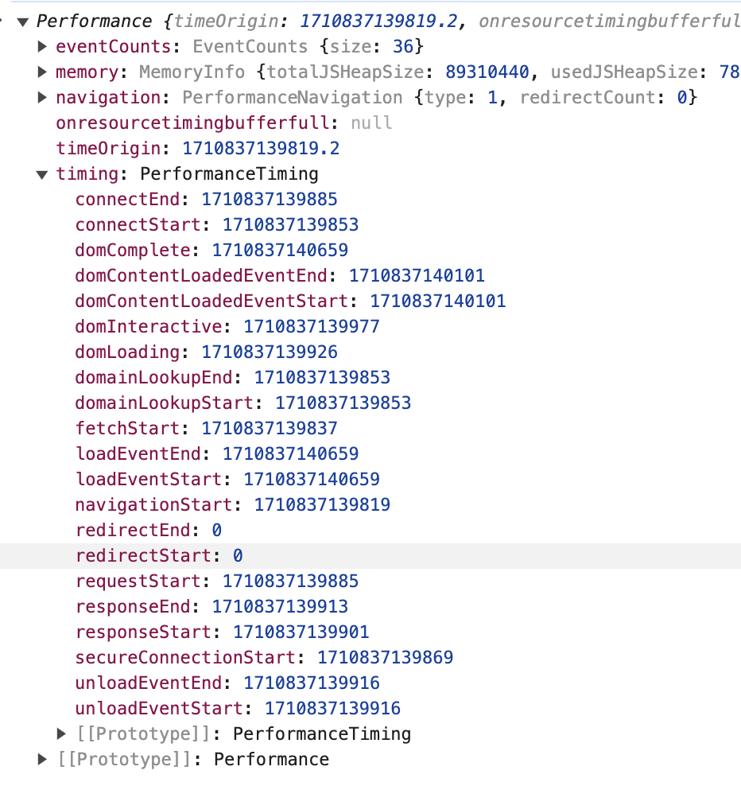
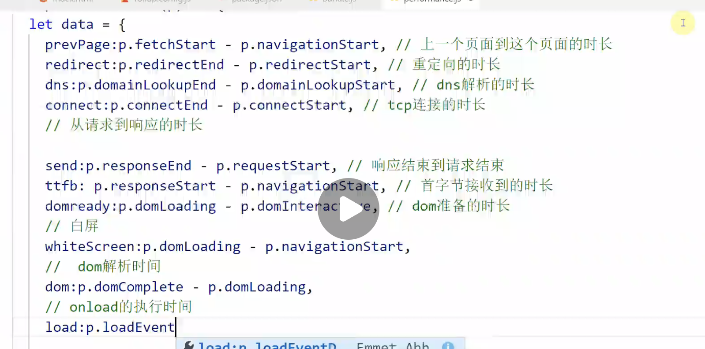
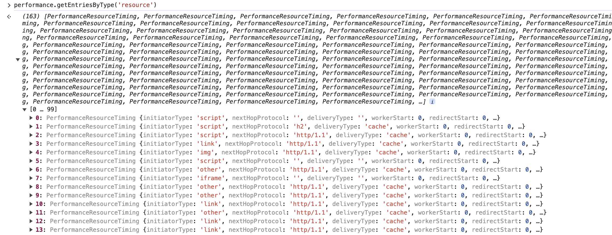
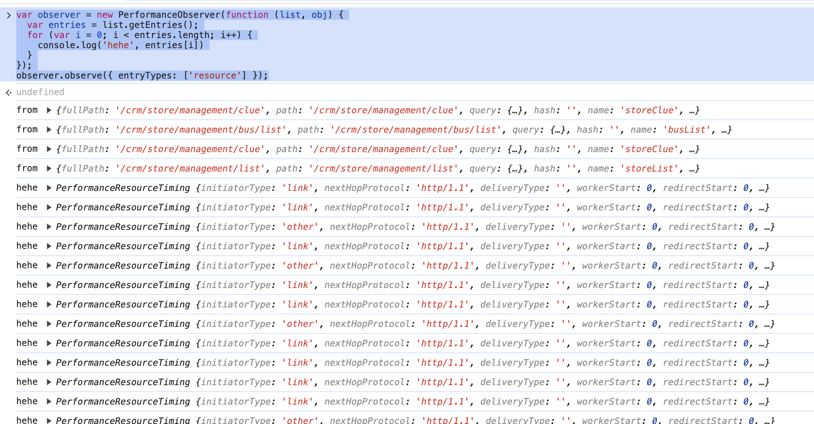

<!--
 * @Author: xinghe 2650710561@qq.com
 * @Date: 2024-03-19 22:17:51
 * @LastEditors: xinghe 2650710561@qq.com
 * @LastEditTime: 2024-03-19 23:27:22
 * @FilePath: /blog/docs/basics/monitar.md
 * @Description: 这是默认设置,请设置`customMade`, 打开koroFileHeader查看配置 进行设置: https://github.com/OBKoro1/koro1FileHeader/wiki/%E9%85%8D%E7%BD%AE
-->
## 页面性能监控

1. 获取页面加载数据API
`performance.timing`


2. 计算常见的加载数据指标



## 页面静态资源加载情况

1. 获取资源加载信息API

`performance.getEntriesByType('resource')`


最新API（不支持IE）
`new PerformanceObserver()`
```js
var observer = new PerformanceObserver(function (list, obj) {
  var entries = list.getEntries();
  for (var i = 0; i < entries.length; i++) {
    console.log('hehe', entries[i])
  }
});
observer.observe({ entryTypes: ['resource'] });
```


## 页面接口请求监控

重写 ajax 的 open 和 send 方法

## js 错误监控

API
`window.onerror`

