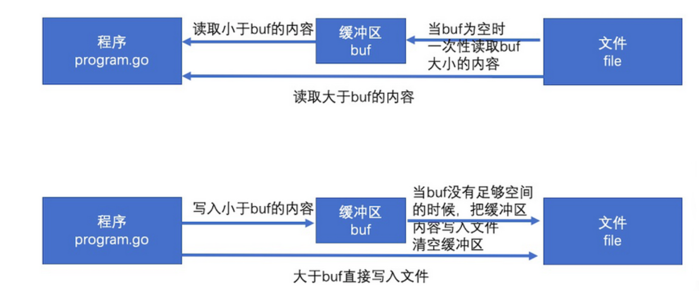

# bufio标准库

bufio包实现了有缓冲的I/O。它包装一个io.Reader或io.Writer接口对象，创建另一个也实现了该接口，且同时还提供了缓冲和一些文本I/O的帮助函数的对象。

## 1. bufio包原理

io操作本身的效率并不低，低的是频繁的访问本地磁盘的文件。所以bufio就提供了缓冲区(分配一块内存)，读和写都先在缓冲区中，最后再读写文件，来降低访问本地磁盘的次数，从而提高效率。

简单的说就是，把文件读取进缓冲（内存）之后再读取的时候就可以避免文件系统的io 从而提高速度。同理，在进行写操作时，先把文件写入缓冲（内存），然后由缓冲写入文件系统。看完以上解释有人可能会表示困惑了，直接把 内容->文件 和 内容->缓冲->文件相比， 缓冲区好像没有起到作用嘛。其实缓冲区的设计是为了存储多次的写入，最后一口气把缓冲区内容写入文件。



bufio 封装了io.Reader或io.Writer接口对象，并创建另一个也实现了该接口的对象。

## 2. type Reader

### 2.1 基础介绍

`bufio.Reader` 是bufio中对io.Reader 的封装

```go
type Reader struct {
    buf          []byte
    rd           io.Reader // reader provided by the client
    r, w         int       // buf read and write positions
    err          error
    lastByte     int // last byte read for UnreadByte; -1 means invalid
    lastRuneSize int // size of last rune read for UnreadRune; -1 means invalid
}
```

`bufio.Read(p []byte)` 相当于读取大小len的内容，思路如下：

1. 当缓存区有内容的时，将缓存区内容全部填入p并清空缓存区
2. 当缓存区没有内容的时候且len>len(buf),即要读取的内容比缓存区还要大，直接去文件读取即可
3. 当缓存区没有内容的时候且len<len(buf),即要读取的内容比缓存区小，缓存区从文件读取内容充满缓存区，并将p填满（此时缓存区有剩余内容）
4. 以后再次读取时缓存区有内容，将缓存区内容全部填入p并清空缓存区（此时和情况1一样）
5. reader内部通过维护一个r, w 即读入和写入的位置索引来判断是否缓存区内容被全部读出。

### 2.2 方法

* `func NewReaderSize`

```go
func NewReaderSize(rd io.Reader, size int) *Reader
```

> NewReaderSize 将 rd 封装成一个带缓存的 bufio.Reader 对象，缓存大小由 size 指定（如果小于 16 则会被设置为 16）。
> 如果 rd 的基类型就是有足够缓存的 bufio.Reader 类型，则直接将rd 转换为基类型返回。

- `func NewReader`

```go
func NewReader(rd io.Reader) *Reader
```

> NewReader相当于NewReaderSize(rd, 4096)

- `func ( * Reader) Reset(r.io.Reader)`

```go
func (b *Reader) Reset(r io.Reader)
```

> Reset丢弃缓冲中的数据，清除任何错误，将b重设为其下层从r读取数据。

```go
package main

import (
	"bufio"
	"fmt"
	"strings"
)

func main() {
	s := strings.NewReader("ABCDEFG")
	str := strings.NewReader("12345")
	br := bufio.NewReader(s)
	b, _ := br.ReadString('\n')
	fmt.Println(b)
	br.Reset(str)
	b, _ = br.ReadString('\n')
	fmt.Println(b)
}
```


- `func ( * Reader) Read`

```go
func (b *Reader) Read(p []byte) (n int, err error)
```

> Read读取数据写入p。本方法返回写入p的字节数。本方法一次调用最多会调用下层Reader接口一次Read方法，因此返回值n可能小于len。读取到达结尾时，返回值n将为0而err将为io.EOF。

```go
package main

import (
	"bufio"
	"fmt"
	"io"
	"strings"
)

func main() {
	s := strings.NewReader("ABCDEFGHIJKLMNOPQRSTUVWXYZ1234567890")
	br := bufio.NewReader(s)
	p := make([]byte, 10)

	for {
		n, err := br.Read(p)
		if err == io.EOF {
			break
		} else {
			fmt.Printf("string(p[0:n]): %v\n", string(p[0:n]))
		}
	}
}
```


- `func (b * Reader) Peek`

```go
func (b *Reader) Peek(n int) ([]byte, error)
```

> Peek 返回缓存的一个切片，该切片引用缓存中前 n 个字节的数据，该操作不会将数据读出，只是引用，引用的数据在下一次读取操作之前是有效的。如果切片长度小于 n，则返回一个错误信息说明原因。
> 如果 n 大于缓存的总大小，则返回 ErrBufferFull。

- `func ( * Reader) ReadByte`

```go
func (b *Reader) ReadByte() (c byte, err error)
```

> ReadByte读取并返回一个字节。如果没有可用的数据，会返回错误。

- `func ( * Reader) UnreadByte`

```go
func (b *Reader) UnreadByte() error
```

> UnreadByte吐出最近一次读取操作读取的最后一个字节。（只能吐出最后一个，多次调用会出问题）

```go
package main

import (
	"bufio"
	"fmt"
	"strings"
)

func main() {
	s := strings.NewReader("ABCDEFG")
	br := bufio.NewReader(s)

	c, _ := br.ReadByte()
	fmt.Printf("%c\n", c)

	c, _ = br.ReadByte()
	fmt.Printf("%c\n", c)

	br.UnreadByte()
	c, _ = br.ReadByte()
	fmt.Printf("%c\n", c)
}
```


- `func ( * Reader) ReadRune`

```go
func (b *Reader) ReadRune() (r rune, size int, err error)
```

> ReadRune读取一个utf-8编码的unicode码值，返回该码值、其编码长度和可能的错误。如果utf-8编码非法，读取位置只移动1字节，返回U+FFFD，返回值size为1而err为nil。如果没有可用的数据，会返回错误。

- `func ( * Reader) UnreadRune`

```go
func (b *Reader) UnreadRune() error
```

> UnreadRune吐出最后一次ReadRune调用读取的unicode码值。如果最近一次读取不是调用的ReadRune，会返回错误。（从这点看，UnreadRune比unreadByte严格很多）

```go
package main

import (
	"bufio"
	"fmt"
	"strings"
)

func main() {
	s := strings.NewReader("你好，世界！")
	br := bufio.NewReader(s)

	c, size, _ := br.ReadRune()
	fmt.Printf("%c %v\n", c, size)

	c, size, _ = br.ReadRune()
	fmt.Printf("%c %v\n", c, size)

	br.UnreadRune()
	c, size, _ = br.ReadRune()
	fmt.Printf("%c %v\n", c, size)

}

```


- `func ( *Reader) ReadLine`

```go
func (b *Reader) ReadLine() (line []byte, isPrefix bool, err error)

```

> ReadLine尝试返回一行数据，不包括行尾标志的字节。如果行太长超过了缓冲，返回值isPrefix会被设为true，并返回行的前面一部分。该行剩下的部分将在之后的调用中返回。返回值isPrefix会在返回该行最后一个片段时才设为false。返回切片是缓冲的子切片，只在下一次读取操作之前有效。ReadLine要么返回一个非nil的line，要么返回一个非nil的err，两个返回值至少一个非nil。
>
> 返回的文本不包含行尾的标志字节（“\r\n”或"\n"）。如果输入流结束时没有行尾标志字节，方法不会出错，也不会指出这一情况。在调用ReadLine之后调用UnreadByte会总是吐出最后一个读取的字节（很可能是该行的行尾标志字节），即使该字节不是ReadLine返回值的一部分。

```go
package main

import (
	"bufio"
	"fmt"
	"strings"
)

func main() {
	s := strings.NewReader("ABC\nDEF\r\nGHI\r\nGHI")
	br := bufio.NewReader(s)

	w, isPrefix, _ := br.ReadLine()
	fmt.Printf("%q %v\n", w, isPrefix)

	w, isPrefix, _ = br.ReadLine()
	fmt.Printf("%q %v\n", w, isPrefix)

	w, isPrefix, _ = br.ReadLine()
	fmt.Printf("%q %v\n", w, isPrefix)

	w, isPrefix, _ = br.ReadLine()
	fmt.Printf("%q %v\n", w, isPrefix)

}
```


- `func ( * Reader) ReadSlice`

```go
func (b *Reader) ReadSlice(delim byte) (line []byte, err error)
```

> ReadSlice读取直到第一次遇到delim字节，返回缓冲里的包含已读取的数据和delim字节的切片。该返回值只在下一次读取操作之前合法。如果ReadSlice放在在读取到delim之前遇到了错误，它会返回在错误之前读取的数据在缓冲中的切片以及该错误（一般是io.EOF）。如果在读取delim之前缓冲就写满了，ReadSlice失败并返回ErrBufferFull。因为ReadSlice的返回值会被下一次I/O操作重写，调用者应尽量使用ReadBytes或ReadString替代本法功法。当且仅当ReadBytes方法返回的切片不以delim结尾时，会返回一次非nil的错误。

```go
package main

import (
	"bufio"
	"fmt"
	"strings"
)

func main() {
	s := strings.NewReader("ABC,DEF,GHI,JKL")
	br := bufio.NewReader(s)

	w, _ := br.ReadSlice(',')
	fmt.Printf("%q\n", w)

	w, _ = br.ReadSlice(',')
	fmt.Printf("%q\n", w)

	w, _ = br.ReadSlice(',')
	fmt.Printf("%q\n", w)
}
```


- `func ( * Reader) ReadString`

```go
func (b *Reader) ReadString(delim byte) (line string, err error)
```

> ReadString读取直到第一次遇到delim字节，返回一个包含已读取的数据和delim字节的字符串。如果ReadString方法在读取到delim之前遇到了错误，它会返回在错误之前读取的数据以及该错误（一般是io.EOF）。当且仅当ReadString方法返回的切片不以delim结尾时，会返回一个非nil的错误。

```go
package main

import (
	"bufio"
	"fmt"
	"strings"
)

func main() {
	s := strings.NewReader("ABC DEF GHI JKL")
	br := bufio.NewReader(s)

	w, _ := br.ReadString(' ')
	fmt.Printf("%q\n", w)

	w, _ = br.ReadString(' ')
	fmt.Printf("%q\n", w)

	w, _ = br.ReadString(' ')
	fmt.Printf("%q\n", w)

}
```

- `func ( * Reader) WriteTo`

```go
func (b *Reader) WriteTo(w io.Writer) (n int64, err error)
```

> WriteTo方法实现了io.WriterTo接口。

```go
package main

import (
	"bufio"
	"bytes"
	"fmt"
	"strings"
)

func main() {
	s := strings.NewReader("ABCDEFGHIJKLMN")
	br := bufio.NewReader(s)
	b := bytes.NewBuffer(make([]byte, 0))

	br.WriteTo(b)
	fmt.Printf("%s\n", b)
}
```


## 3. type Writer

### 3.1 基础介绍

`bufio.Writer` 是bufio中对io.Writer 的封装

```go
type Writer struct {
    err error
    buf []byte
    n   int
    wr  io.Writer
}
```

`bufio.Write(p []byte)` 的思路如下

1. 判断buf中可用容量是否可以放下 p
2. 如果能放下，直接把p拼接到buf后面，即把内容放到缓冲区
3. 如果缓冲区的可用容量不足以放下，且此时缓冲区是空的，直接把p写入文件即可
4. 如果缓冲区的可用容量不足以放下，且此时缓冲区有内容，则用p把缓冲区填满，把缓冲区所有内容写入文件，并清空缓冲区
5. 判断p的剩余内容大小能否放到缓冲区，如果能放下（此时和步骤1情况一样）则把内容放到缓冲区
6. 如果p的剩余内容依旧大于缓冲区，（注意此时缓冲区是空的，情况和步骤3一样）则把p的剩余内容直接写入文件

### 3.2 方法

- `func NewWriter`

```go
func NewWriter(w io.Writer) *Writer
```

> NewWriter创建一个具有默认大小缓冲、写入w的*Writer。NewWriter相当于NewWriterSize(wr, 4096)

- `func NewWriterSize`

```go
func NewWriterSize(w io.Writer, size int) *Writer
```

> NewWriterSize创建一个具有最少有size尺寸的缓冲、写入w的Writer。如果参数w已经是一个具有足够大缓冲的Writer类型值，会返回w。

- `func ( * Writer) Reset`

```go
func (b *Writer) Reset(w io.Writer)
```

> Reset丢弃缓冲中的数据，清除任何错误，将b重设为将其输出写入w。

```go
package main
 
import (
    "bufio"
    "bytes"
    "fmt"
)
 
func main() {
    b := bytes.NewBuffer(make([]byte, 0))
    bw := bufio.NewWriter(b)
    bw.WriteString("123456789")
    c := bytes.NewBuffer(make([]byte, 0))
    bw.Reset(c)
    bw.WriteString("456")
    bw.Flush()
    fmt.Println(b)
    fmt.Println(c)
}
```


- `func ( * Writer) Buffered`

```go
func (b *Writer) Buffered() int
```

> Buffered返回缓冲中已使用的字节数。

- `func ( * Writer) Available`

```go
func (b *Writer) Available() int
```

> Available返回缓冲中还有多少字节未使用。

- `func ( * Writer) Write`

```go
func (b *Writer) Write(p []byte) (nn int, err error)
```

> Write将p的内容写入缓冲。返回写入的字节数。如果返回值nn < len，还会返回一个错误说明原因。

- `func ( * Writer) WriteString`

```go
func (b *Writer) WriteString(s string) (int, error)
```

> WriteString写入一个字符串。返回写入的字节数。如果返回值m < len(s)，还会返回一个错误说明原因。

- `func ( * Writer) WriteByte`

```go
func (b *Writer) WriteByte(c byte) error
```

> WriteByte写入单个字节。

- `func ( * Writer) WriterRune`

```go
func (b *Writer) WriteRune(r rune) (size int, err error)
```

> WriteRune写入一个unicode码值（的utf-8编码），返回写入的字节数和可能的错误。

- `func ( * Writer) Flush`

```go
func (b *Writer) Flush() error
```

> Flush方法将缓冲中的数据写入下层的io.Writer接口。

- `func ( * Writer) ReadFrom`

```go
func (b *Writer) ReadFrom(r io.Reader) (n int64, err error)
```

> ReadFrom实现了io.ReaderFrom接口。

实例演示一：

```go
package main
 
import (
    "bufio"
    "bytes"
    "fmt"
)
 
func main() {
    b := bytes.NewBuffer(make([]byte, 0))
    bw := bufio.NewWriter(b)
    fmt.Println(bw.Available()) // 4096
    fmt.Println(bw.Buffered())  // 0
 
    bw.WriteString("ABCDEFGHIJKLMN")
    fmt.Println(bw.Available())
    fmt.Println(bw.Buffered())
    fmt.Printf("%q\n", b)
 
    bw.Flush()
    fmt.Println(bw.Available())
    fmt.Println(bw.Buffered())
    fmt.Printf("%q\n", b)
}

```

实例演示二：

```go
package main
 
import (
    "bufio"
    "bytes"
    "fmt"
    "strings"
)
 
func main() {
    b := bytes.NewBuffer(make([]byte, 0))
    s := strings.NewReader("Hello 世界！")
    bw := bufio.NewWriter(b)
    bw.ReadFrom(s)
    // bw.Flush() // ReadFrom无需使用Flush，其自己已经写入
    fmt.Println(b) // Hello 世界！
}
```


## 4. type ReadWriter

### 4.1 基础介绍

ReadWriter类型保管了指向Reader和Writer类型的指针，（因此）实现了io.ReadWriter接口。

```go
type ReadWriter struct {
    *Reader
    *Writer
}
```

### 4.2 方法

- `func NewReadWriter`

```go
func NewReadWriter(r *Reader, w *Writer) *ReadWriter
```

> NewReadWriter申请创建一个新的、将读写操作分派给r和w的ReadWriter。

```go
package main
 
import (
    "bufio"
    "bytes"
    "fmt"
    "strings"
)
 
func main() {
    b := bytes.NewBuffer(make([]byte, 0))
    bw := bufio.NewWriter(b)
    s := strings.NewReader("123")
    br := bufio.NewReader(s)
    rw := bufio.NewReadWriter(br, bw)
    p, _ := rw.ReadString('\n')
    fmt.Println(string(p)) // 123
    rw.WriteString("asdf")
    rw.Flush()
    fmt.Println(b) // asdf
}
```


## 5. type SplitFunc

```go
type SplitFunc func(data []byte, atEOF bool) (advance int, token []byte, err error)
```

SplitFunc类型代表用于对输出作词法分析的分割函数。

> 参数data是尚未处理的数据的一个开始部分的切片，参数atEOF表示是否Reader接口不能提供更多的数据。返回值是解析位置前进的字节数，将要返回给调用者的token切片，以及可能遇到的错误。如果数据不足以（保证）生成一个完整的token，例如需要一整行数据但data里没有换行符，SplitFunc可以返回(0, nil, nil)来告诉Scanner读取更多的数据写入切片然后用从同一位置起始、长度更长的切片再试一次（调用SplitFunc类型函数）。
>
> 如果返回值err非nil，扫描将终止并将该错误返回给Scanner的调用者。
>
> 除非atEOF为真，永远不会使用空切片data调用SplitFunc类型函数。然而，如果atEOF为真，data却可能是非空的、且包含着未处理的文本。
>
> SplitFunc的作用很简单，从data中找出你感兴趣的数据，然后返回并告诉调用者，data中有多少数据你已经处理过了。

~~~go
// open the file
	file, err := os.Open("test2.txt")

	// handle errors while opening
	if err != nil {
		log.Fatalf("Error when opening file: %s", err)
	}
	defer file.Close()

	fileScanner := bufio.NewScanner(file)
	fileScanner.Split(bufio.ScanWords)
	// read line by line
	for fileScanner.Scan() {
		fmt.Println(fileScanner.Text())
	}
	// handle first encountered error while reading
	if err := fileScanner.Err(); err != nil {
		log.Fatalf("Error while reading file: %s", err)
	}
~~~


## 6. type Scanner

### 6.1 基础介绍

```go
type Scanner struct {
    r            io.Reader // The reader provided by the client.
    split        SplitFunc // The function to split the token.
    maxTokenSize int       // Maximum size of a token; modified by tests.
    token        []byte    // Last token returned by split.
    buf          []byte    // Buffer used an argument to split.
    start        int       // First non-processed byte in buf.
    end          int       // End of data in buf.
    err          error     // Sticky error.
}
```

Scanner类型提供了方便的读取数据的接口，如从换行符分隔的文本里读取每一行。成功调用的Scan方法会逐步提供文件的token，跳过token之间的字节。token由SplitFunc类型的分割函数指定；默认的分割函数会将输入分割为多个行，并去掉行尾的换行标志。本包预定义的分割函数可以将文件分割为行、字节、unicode码值、空白分隔的word。调用者可以定制自己的分割函数。扫描会在抵达输入流结尾、遇到的第一个I/O错误、token过大不能保存进缓冲时，不可恢复的停止。当扫描停止后，当前读取位置可能会在最后一个获得的token后面。需要更多对错误管理的控制或token很大，或必须从reader连续扫描的程序，应使用buffio.Reader代替。

### 6.2 方法

- `func ScanBytes`

```go
func ScanBytes(data []byte, atEOF bool) (advance int, token []byte, err error)
```

> ScanBytes是用于Scanner类型的分割函数（符合SplitFunc），本函数会将每个字节作为一个token返回。

- `func ScanRunes`

```go
func ScanRunes(data []byte, atEOF bool) (advance int, token []byte, err error)
```

> ScanRunes是用于Scanner类型的分割函数（符合SplitFunc），本函数将每个utf-8编码的unicode码值作为一个token返回。本函数返回的rune序列和range一个字符串的输出rune序列相同。错误的utf-8编码会翻译为U+FFFD=“\xef\xbf\xbd”，但只会消耗一个字节。调用者无法区分正确编码的rune和错误编码的rune。

- `func ScanWords`

```go
func ScanWords(data []byte, atEOF bool) (advance int, token []byte, err error)
```

> ScanRunes是用于Scanner类型的分割函数（符合SplitFunc），本函数会将空白分隔的片段（去掉前后空白后）作为一个token返回。本函数永远不会返回空字符串。用来找出data中的单行数据并返回（包括空行）

- `func ScanLines`

```go
func ScanLines(data []byte, atEOF bool) (advance int, token []byte, err error)
```

> ScanLines是用于Scanner类型的分割函数（符合SplitFunc），本函数会将每一行文本去掉末尾的换行标记作为一个token返回。返回的行可以是空字符串。换行标记为一个可选的回车后跟一个必选的换行符。最后一行即使没有换行符也会作为一个token返回。

- `func NewScanner`

```go
func NewScanner(r io.Reader) *Scanner
```

> NewScanner创建并返回一个从r读取数据的Scanner，默认的分割函数时ScanLines。

- `func ( * Scanner) Split`

```go
func (s *Scanner) Split(split SplitFunc)
```

> Split设置该Scanner的分割函数。本方法必须在Scan之前调用。

```go
package main
 
import (
    "bufio"
    "fmt"
    "strings"
)
 
func main() {
    s := strings.NewReader("ABC DEF GHI JKL")
    bs := bufio.NewScanner(s)
    bs.Split(bufio.ScanWords)
    for bs.Scan() {
        fmt.Println(bs.Text())
    }
 
}
```


- `func ( * Scanner) Scan`

```go
func (s *Scanner) Scan() bool
```

> Scan方法获取当前位置的token（该token可以通过Bytes或Text方法获得），并让Scanner的扫描位置移动到下一个token。当扫描因为抵达输入流结尾或者遇到错误而停止时，本方法会返回false。在Scan方法返回false后，Err方法将返回扫描时遇到的任何错误；除非是io.EOF，此时Err会返回nil。

```go
package main
 
import (
    "bufio"
    "fmt"
    "strings"
)
 
func main() {
    s := strings.NewReader("Hello 世界！")
    bs := bufio.NewScanner(s)
    bs.Split(bufio.ScanBytes)
    for bs.Scan() {
        fmt.Printf("%s", bs.Text())
    }
 
}
```


- `func ( * Scanner) Bytes`

```go
func (s *Scanner) Bytes() []byte
```

> Bytes方法返回最近一次Scan调用生成的token。底层数组指向的数据可能会被下一次Scan的调用重写。

```go
package main
 
import (
    "bufio"
    "fmt"
    "strings"
)
 
func main() {
    s := strings.NewReader("Hello 世界！")
    bs := bufio.NewScanner(s)
    bs.Split(bufio.ScanRunes)
    for bs.Scan() {
        fmt.Printf("%s", bs.Text())
    }
 
}
```


- `func ( * Scanner) Text`

```go
func (s *Scanner) Text() string
```

> Bytes方法返回最近一次Scan调用生成的token，会申请创建一个字符串保存token并返回该字符串。

- `func ( * Scanner) Err`

```go
func (s *Scanner) Err() error
```

> Err返回Scanner遇到的第一个非EOF的错误。