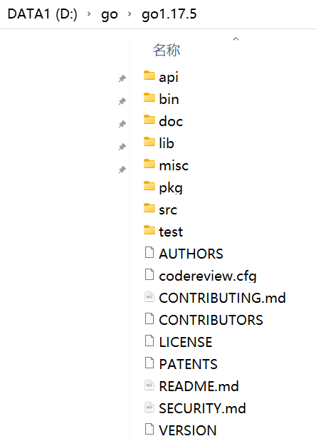
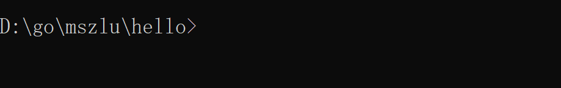
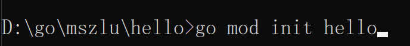
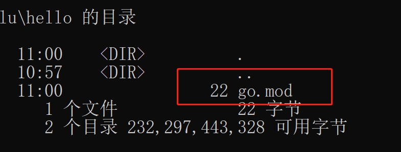
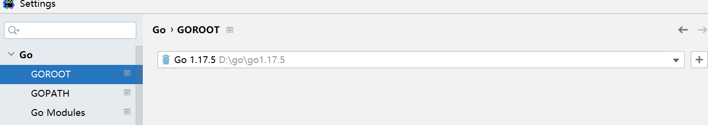

# 1. Go历史

## 1.1 诞生时间

Go 语言起源 2007 年，并于 2009 年正式对外发布。它从 2009 年 9 月 21 日开始作为谷歌公司 20% 兼职项目，即相关员工利用 20% 的空余时间来参与 Go 语言的研发工作。

- 2007 年 9 月 20 日的下午，在谷歌山景城总部的一间办公室里，谷歌的大佬级程序员 Rob Pike在等待一个 C++ 项目构建的过程中和谷歌的另外两个大佬级程序员 Robert Griesemer和 Ken Thompson进行了一次有关设计一门新编程语言的讨论。
  - 计算机硬件技术更新频繁，性能提高很快。目前主流的编程语言发展明显落后于硬件，不能合理利用多核多CPU的优势提升软件系统性能。
  - 软件系统复杂度越来越高，维护成本越来越高，目前缺乏一个足够简洁高效的编程语言。
  - 企业运行维护很多c/c++的项目，C/C++程序运行速度虽然很快（因为采用静态编译），但是编译速度却很慢，同时还存在内存泄露的一系列困扰需要解决。

## 1.2 里程碑

- 2007年，谷歌工程师Ken Thompson、Rob Pike、Robert Griesemer开始设计一门全新的语言，这是Go语言的最初原型。
- 2009.11.10 ，Google将Go语言以开放源代码的形式向全球发布。
- 2015年8月19日 ，Go1.5版本发布，本次更新中移除了“最后残余的C代码”，请内存管理方面权威专家Rick Hudson对GC进行重新设计（重要的修正）
- 2017年2月16日 ， Go1.8版本发布
- 2017年8月24日 ， Go1.9版本发布
- 2018年2月16日 ， Go1.10版本发布
- 2018年8月24日 ， Go1.11版本发布
- 2019年2月25日 ， Go1.12版本发布
- 2019年9月03日 ， Go1.13版本发布
- 2020年2月25日 ， Go1.14版本发布
- 2020年8月11日 ， Go1.15版本发布
- 2021年2月16日 ， Go1.16版本发布
- 2021年8月16日 ， Go1.17版本发布

## 1.3 团队核心人员

`Ken Thompson（肯·汤普逊）`:1983年图灵奖、1998年美国国家技术奖得主，他与Dennis Ritchie是Unix系统的原创者。Thompson也发明了C语言、B语言，同时也是C语言的主要发明人。
`Rob Pike（罗布·派克）`： 加拿大人，曾是贝尔实验室的Unix团队和Plan 9操作计划的成员。他与Thompson共事多年，并共创出广泛使用的UTF-8字符编码。（ps：Go语言的图标-gopher 囊地鼠，是Rob Pike老婆制作的）
`Robert Griesemer(罗伯特·格里泽默)`：曾协助制作Java的HotSpot编译器，和Chrom浏览器的JavaScript引擎V8.

# 2. 为什么使用Go

1. 简单好记的关键词和语法。轻松上手，简单易学。
2. 更高的效率。比Java，C++等拥有更高的编译速度，同时运行效率媲美C，同时开发效率非常高。
3. 生态强大，网络上库很丰富，很多功能使用Go开发非常简单。
4. 语法检查严格，高安全性。
5. 严格的依赖管理，go mod命令。
6. Go拥有强大的编译检查、严格的编码规范和完整的软件生命周期工具，具有很强的稳定性，稳定压倒一切。
7. 跨平台交叉编译，windows就可以编译出mac，linux上可执行的程序。
8. 异步编程复杂度低，易维护，GO 语言中 Channel 设计，异步程序写起来非常自然。
9. 语言层面支持并发，`go关键字（协程）`使得go的并发效率极高。
10. 严格的语法规范，所有程序员写出来的代码都是一样的，对大团队来说，非常友好。
11. Go 的并发、性能、安全性、易于部署等特性，使它很容易成为“云原生语言”。容器和云的使用上非常广

# 3. Go下载

资料中有提供go1.17.5的版本，windows的zip包

下载地址：https://go.dev/dl/

# 4. 环境变量配置

> 将go的压缩包，解压

要使用go首先需要配置几个环境变量：

1. `GOROOT`：go语言所在的目录，用于全局执行go相关的命令

   

   path中也需要配置

   

2. `GOPATH`：工作目录，工程代码存放的位置，此目录下，一个文件夹就是一个工程

   

3. `GOPROXY`：代理，由于go需要翻墙使用，需要配置代理，有好心人做了代理

   

   地址：https://goproxy.io/zh/ 可以去看文档

4. go env 可以检查环境变量的配置是否正确

**配置完环境变量，我们就可以开始写代码了**

# 5. 入门案例

在我们的GOPATH路径下，新建一个文件夹，hello

进入hello目录，运行cmd命令

~~~go
# 运行下面的命令
go mod init hello
~~~

会生成一个go.mod文件，如果学过maven的话，可以将其当成maven的pom.xml，用于管理依赖的。

**接下来，写程序**

新建man.go

在其中输入以下内容：

~~~go
// package 定义包名 main 包名
package main

// import 引用库 fmt 库名
import "fmt"

// func 定义函数 main 函数名
func main() {
	// fmt 包名 . 调用 Print 函数,并且输出定义的字符串
	fmt.Print("Hello Golang")
}
~~~

运行以下命令:

~~~go
go run main.go
~~~

**OK,现在我们入门了~~**

# 6. 开发工具

> 工欲善其事，必先利其器，这里我们选用GoLand做为我们的开发IDE。

这里我使用的是，2021.2.3版本，资料中有

**直接运行即可**

注意在设置中，go相关的配置

