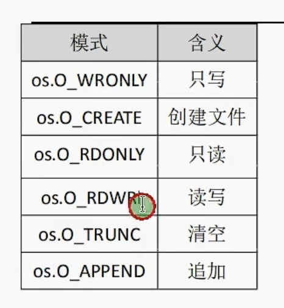

<!--
 * @Author: xinghe 2650710561@qq.com
 * @Date: 2024-08-22 17:34:21
 * @LastEditors: xinghe 2650710561@qq.com
 * @LastEditTime: 2024-08-22 20:27:57
 * @FilePath: /blog/docs/go/summary/22.文件操作.md
 * @Description: 这是默认设置,请设置`customMade`, 打开koroFileHeader查看配置 进行设置: https://github.com/OBKoro1/koro1FileHeader/wiki/%E9%85%8D%E7%BD%AE
-->
## 读取文件

**通过 `os.Open` 读取文件**

`os.Open` 以只读方式打开文件

```go
// os.Open 通过文件路径返回文件内存位置
filePoint, err := os.Open("./nginx.md")
if err != nil {
    fmt.Println("读取文件失败")
    return
}
// 通过 os.Open 方法打开的文件必须关闭
defer filePoint.Close()

// 存放文件数据的切片
var fileSlice []byte
// 一次读取文件 128 个字节
bufferSlice := make([]byte, 128)
for {
    // 文件指针 Read 方法读取文件数据
    // 接收 byte 类型切片（用户存储文件数据）
    // 返回读取字节数和错误信息，错误信息为 io.EOF 时文件读取完毕
    n, err := filePoint.Read(bufferSlice)
    if err == io.EOF {
        fmt.Println("文件读取完成")
        break
    }
    fileSlice = append(fileSlice, bufferSlice[:n]...)
}
// 通过 string 方法将 byte 类型的切片转化为字符串
fmt.Println(string(fileSlice))
```

**通过 bufio 读取文件**

```go
// os.Open 通过文件路径返回文件内存位置
filePoint, err := os.Open("./nginx.md")
if err != nil {
    fmt.Println("读取文件失败")
    return
}
// 通过 os.Open 方法打开的文件必须关闭
defer filePoint.Close()

var fileStr string
reader := bufio.NewReader(filePoint)
for {
    str, e := reader.ReadString('\n')
    if e == io.EOF {
        fileStr += str
        break
    }
    fileStr += str
}
fmt.Println(fileStr)
```  

**通过 `ioutil.ReadFile` 方法读取文件**

1.16 版本后被废弃

```go
fileSlice, err := ioutil.ReadFile("./nginx.md")

if err != nil {
    fmt.Println("读取文件失败")
    return
}

fmt.Println(string(fileSlice))
```

## 写入文件

**`os.OpenFile`**



```go

```

**`bufio.NewWriter`**

```go

```