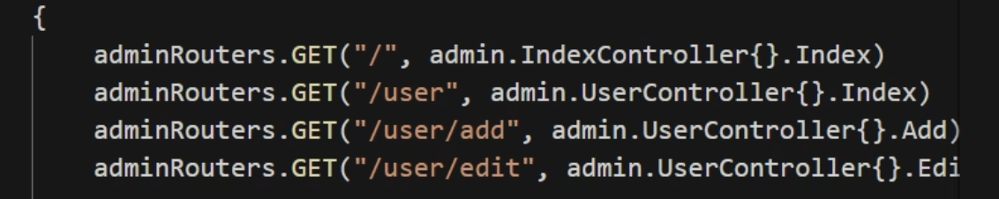

<!--
 * @Author: xinghe 2650710561@qq.com
 * @Date: 2024-08-27 19:24:27
 * @LastEditors: xinghe 2650710561@qq.com
 * @LastEditTime: 2024-10-08 17:42:33
 * @FilePath: /blog/docs/go/summary/23.Gin.md
 * @Description: 这是默认设置,请设置`customMade`, 打开koroFileHeader查看配置 进行设置: https://github.com/OBKoro1/koro1FileHeader/wiki/%E9%85%8D%E7%BD%AE
-->
## 介绍

Gin 是 go 的高性能轻量级 http web 框架

## 初始化一个 go 项目

- go mod init 项目名 托管项目
- 项目中使用第三方包
- go mod tidy


## 使用 Gin 创建一个后台服务

```go
package main

import (
	"net/http"

	"github.com/gin-gonic/gin"
)

func main() {
	r := gin.Default()
	r.GET("/ping", func(c *gin.Context) {
		c.String(http.StatusOK, "hello gin")
	})
	r.Run(":3000")
}
```

## 使用 fresh 实现代码变更重启服务

```bash
# 安装 refresh
go get github.com/pilu/fresh
# 使用 refresh 启动项目（以 main.go 为入口）
fresh
# 如果出现找不到命令可以使用一下命令
go run github.com/pilu/fresh
```

## 获取 get 请求 query 参数

- c.Query(key) 获取对应 query 值
- c.DefaultQuery(key, defaultValue) 获取对应 query 并设置默认值

## 获取 post 请求提交的值

- c.PostForm(key)
- c.DefaultPostForm(key, defalutValue)

## 将 get 请求 query 绑定到结构体里

c.ShouldBind

```go
type Account struct {
	Username string `json:"username" form:"username"`
	Password string `json:"password" form:"password"`
}

r.GET("/struct", func(ctx *gin.Context) {
    account := &Account{}
    err := ctx.ShouldBind(account)
    if err == nil {
        ctx.JSON(http.StatusOK, account)
    } else {
        ctx.JSON(http.StatusOK, gin.H{
            "message": "error",
        })
    }
})
```

## 将 post 中请求的数据绑定到结构体内

c.ShouldBind 和 get 请求一样

## 获取 Post xml 数据（支付会用到）

c.GetRawData

## 获取 get 请求路径参

c.Param(key)

## 路由分组
```go
router := gin.Default()

// 简单的路由组: v1
v1 := router.Group("/v1")
{
    v1.POST("/login", loginEndpoint)
    v1.POST("/submit", submitEndpoint)
    v1.POST("/read", readEndpoint)
}

// 简单的路由组: v2
v2 := router.Group("/v2")
{
    v2.POST("/login", loginEndpoint)
    v2.POST("/submit", submitEndpoint)
    v2.POST("/read", readEndpoint)
}
```
**路由分组 routers**

通过 Group 将路由抽离到不同的模块

**控制器分组 controllers**

路由对应的处理函数称为控制器



控制器推荐使用结构体方法的形式定义，这样可以很好的使用结构体继承的的特性，实现公共方法的提取。

## 中间件

```go
func initMiddleWare(c *gin.Context) {
    fmt.Println("init")
}

r.GET("/ping", initMiddleWare, func(c *gin.Context) {
    c.String(http.StatusOK, "hello gin")
})
```

c.Next 执行下一个处理函数
c.Abort 终止执行剩余处理函数

- 路由中间件
- 全局中间件
```go
r.Use(middleWare)
```

中间件建议抽取到 middleware 目录下 

**中间件数据共享**

```go
ctx.Set("key", value)
ctx.Get("key")
```

**tip**

在中间件或则 handler 中使用协程时，不能使用原始的上下文（c *gin.Context）。需要使用只读副本。

```go
r.GET("/test", func(c *gin.Context) {
    cCp := c.Copy()
})
```

## models

MVC 中的 M
V 视图
C 控制器


