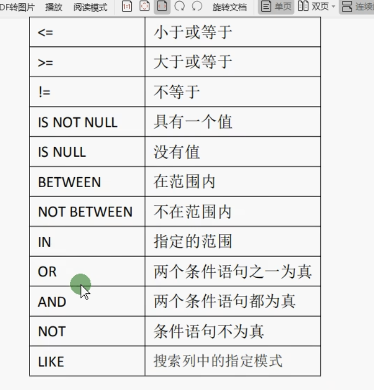

<!--
 * @Author: xinghe 2650710561@qq.com
 * @Date: 2024-10-14 17:15:41
 * @LastEditors: xinghe 2650710561@qq.com
 * @LastEditTime: 2024-10-15 19:34:45
 * @FilePath: /blog/docs/go/summary/26.mysql.md
 * @Description: 这是默认设置,请设置`customMade`, 打开koroFileHeader查看配置 进行设置: https://github.com/OBKoro1/koro1FileHeader/wiki/%E9%85%8D%E7%BD%AE
-->
## 常用命令

```bash
# 展示数据库
show databases;
# 展示表
show tables;

# 进入数据库
use xxx;

# 统计数据总数
select count(1) from user;
 
# 分页
# 第一页 10 条
select * from user limit 0, 10;
# 第二页 10 条
select * from user limit 1, 10;
```

- 常用操作符


更多命令
https://www.runoob.com/mysql/mysql-tutorial.html

## 数据类型

#### 数值类

常用整形
- tinyint 1 个字节 -128 +127
- int 4 个字节 -8388608 +8388608
- bigint 8 个字节 好多个亿

常用浮点形
- decimal 可变取值范围 

## 字符

- char 固定字节（char(10)表示固定占用 10 个字符内存空间）
- varchar 可变字节 （varchar(10) 表示最大 10 个字节，具体存储根据实际字符长度）

## 备注类

- tinytext 字符串，最大长度 255
- text 字符串，最大长度 65535
- mediumtext 字符串 最大长度 16777215
- longtext 字符串 最大长度 四十多个亿

## 分组函数

- avg 求平均值
- count 统计行数
- max 最大值
- min
- sum 求和

```bash
# score 平均值
select avg(score) from user;
# score 最大值
select max(score) from user;
# score 总值
select sum(score) from user;
# 总行数
select count(1) from user;
```

## 表与表之间的关系

- 笛卡尔积连接（关联查询）*不推荐
```bash
# 语法：select 表1.字段, 表2.字段 from 表1, 表2 where 表1.id = 表2.id;

select article.title, article.content, article.id, category.name from article, category where article.id = category.id;
```

- 内连接（关联查询）*推荐
```bash
# inner join 表 on 条件
# 语法：select 表1.字段, 表2.字段 from 表1 inner join 表2 on 表1.id = 表2.id;

select article.title, article.content, article.id, category.name from article INNER JOIN category ON article.id = category.id;
```

- 左外连接（关联查询）
```bash
# left join 表 on 条件
```

- 右外连接（关联查询）
```bash
# right join 表 on 条件
```


**tip**

关联查询对比普通查询需要更多的性能。
关联查询推荐使用内连接，笛卡尔积连接性能更差。

## 索引

作用：能够让查询速度变得非常快，不过多少条数据，扫描只需要扫一条。

**普通索引**

```sql
-- 创建索引
-- 语法 create index 索引名称 on 表名(字段名);
create index user_name_index on user(user_name);

-- 删除索引
-- 语法 drop index 索引名称 on 表名
drop index user_name_index on user;
```

**唯一索引**

数据不允许重复（主键默认就是唯一索引）

```sql
-- 创建索引
-- 语法 create unique index 索引名称 on 表名(字段名);
create unique index user_name_index on user(user_name);

-- 删除索引
-- 语法 drop unique index 索引名称 on 表名
drop unique index user_name_index on user;
```

## 事务

保证整个任务完全执行（应用场景如： A 的钱转给 B）。

- begin 开启事务
- rollback 回滚事务
- commit 提交事务

```sql
-- 开启事务
begin;
-- 扣掉 A 的钱
-- 给 B 添加钱

-- 提交事务
commit;
```

## 锁
 
**读锁**

在解锁之前，所有人都只能读不能操作。

```sql
-- 语法 lock table 表名 read;
```

**写锁**

只有写锁人能进行读写操作，其他人既不能读也不能写。

```sql
-- 语法 lock table 表名 write;
```

**解锁**
```sql
unlock tables;
```
